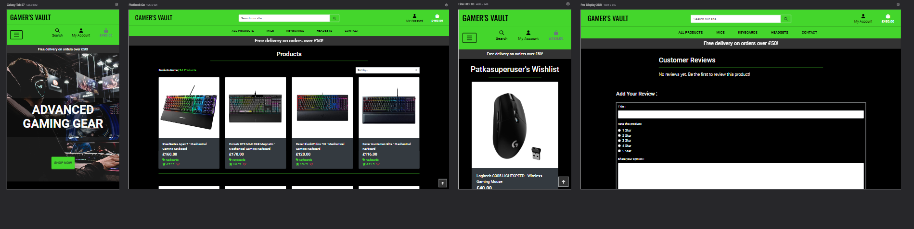

# GAMER'S VAULT

[Link to a live site](https://gamers-vault-72a0e73da873.herokuapp.com/)


# Introduction to Gamer's Vault: A Full-Stack E-Commerce Platform for Gaming Equipment

Welcome to my fourth project, part of the Code Institute Full Stack Development Course. The aim of this project is to develop a fully functional, full-stack e-commerce web application using Django.

**Gamer's Vault** offers a seamless shopping experience for gaming enthusiasts, featuring user registration for personalized account management and wishlist creation. Registered users can write product reviews to assist others in making informed decisions. The site ensures secure purchasing and provides easy order inquiries for enhanced customer support. Additionally, the guest checkout option allows non-registered users to make purchases without needing an account, providing flexibility and convenience.

## UXD – User Experience Design

A user experience designer, Jesse James Garrett, introduced five UX design elements in his book The Elements of User Experience.
In the book, he explains the steps of user experience projects and what UX designers should consider at each stage.
This is where most of my planning process steps came from.

The 5 planes of UX are as below:

- The Strategy Plane
- The Scope Plane
- The Structure Plane
- The Skeleton Plane
- The Surface Plane

## The Strategy Plane

### Creator Goals

As the creator of this e-commerce platform, my primary goals are:

1. **Provide a Seamless Shopping Experience:** I aim to create a user-friendly and visually appealing platform that allows customers to easily browse, search, and purchase gaming peripherals such as keyboards, mice, and headsets.

2. **Cater to Gaming Enthusiasts:** I want to build a platform that caters specifically to gaming enthusiasts by offering high-quality products and detailed descriptions to help users make informed purchasing decisions.

3. **Offer Customization and Personalization:** Through features like Wishlist and Product Reviews, I plan to offer users a more personalized shopping experience, allowing them to save their favorite items and share their feedback on purchases.

4. **Ensure Secure and Efficient Transactions:** Security and efficiency are paramount, so I aim to implement a reliable and secure payment system that protects user data and ensures smooth transactions.

5. **Create a Scalable and Maintainable Platform:** I strive to build a platform that is not only scalable to accommodate growth but also maintainable, with clean code and a solid structure for future upgrades and features.

6. **Engage and Retain Users:** By providing features like product reviews and a Wishlist, I aim to engage users and encourage repeat visits, fostering a community of gaming enthusiasts around the platform.

### User Stories

#### Guest User

1. **As a Guest User,** I want to easily browse gaming keyboards, mice, and headsets so that I can find products that interest me.

2. **As a Guest User,** I want to search for specific gaming peripherals by name, brand, or type so that I can quickly find the items I’m looking for.

3. **As a Guest User,** I want to view detailed product descriptions, including specifications and high-quality images, so that I can make an informed purchasing decision.

4. **As a Guest User,** I want to add products to my cart and check out without needing to create an account, so that I can make a quick purchase.

5. **As a Guest User,** I want to see customer reviews and ratings for products so that I can understand the experiences of others before buying.

6. **As a Guest User,** I want to be able to sign up for an account.

#### Registered User

1. **As a Registered User,** I want to log in securely so that I can access my account and previous orders.

2. **As a Registered User,** I want to add products to my Wishlist so that I can save items I'm interested in for future reference.

3. **As a Registered User,** I want to view and edit my profile information, including my shipping address and payment methods, so that I can easily manage my account.

4. **As a Registered User,** I want to leave reviews and ratings for products I've purchased so that I can share my experience with other users.

5. **As a Registered User,** I want to view my order history so that I can easily reorder items or track my past purchases.

6. **As a Registered User,** I want to be able to remove items from my Wishlist if I no longer desire them, so that I can keep my Wishlist up to date.

## The Scope Plane 

The planning process allowed me to prioritize the implementation of features based on their importance to my user stories, enabling me to identify which ones could be completed within the given deadline and which ones would need to be postponed for later implementation.

### Features implemented upon webpage release:

1. **User Registration and Login**:  
   Users can create an account to manage their shopping experience and access additional features.

2. **Wishlist Creation**:  
   Logged-in users can curate a personalized wishlist of their favorite gaming products, making it easy to keep track of what they want.

3. **Product Reviews**:  
   Registered users can share their opinions on products by writing reviews, helping fellow gamers make informed purchasing decisions.

4. **Secure Purchasing**:  
   Users can seamlessly purchase gaming equipment directly from the platform, all while enjoying a secure and reliable shopping experience.

5. **Order Inquiries**:  
   Users can easily contact the shop regarding their orders, enhancing customer support and satisfaction.

6. **Guest Checkout**:  
   Guests can browse and purchase products without creating an account, ensuring a smooth and hassle-free shopping experience.

7. **Shopping Basket**:  
   Users can easily add products to their shopping basket for checkout, streamlining the purchasing process.

8. **Search Bar**:  
   Users can quickly find products using the search functionality, making navigation fast and easy.

9. **User Dashboard**:  
   Registered users can access a dashboard to view their order history and manage their account.

10. **Product Filter**:  
    Users can filter products based on criteria like price, category, and brand to find what they need faster.

11. **Product Categories**:  
    Products are organized into categories, allowing users to browse specific types of products efficiently.


### Features planned to implement later:

- **Two-step authentication**
- **Live chat**
- **Q&A Forum**

*Above decisions have been made based on the below table.*

| Feature         | Feasibility | Importance |
| --------------- |:-----------:|:----------:|
| Registration    |      5      |     5      |
| Two-step auth.  |      4      |     3      |
| Wishlist        |      5      |     5      |
| Product reviews |      5      |     5      |
| Contact         |      5      |     4      |
| Live chat       |      3      |     2      |
| Secure purch.   |      5      |     5      |
| Basket          |      5      |     5      |
| Search bar      |      5      |     5      |
| User dashboard  |      5      |     4      |
| Product filter  |      5      |     4      |
| Product cat.    |      5      |     5      |


## The Structure Plane

### Colors:

`#000`:

- Body
- Footer links
- Navbar icons
- Navbar font color
- Checkout toast button


`#FAFAFA`:

- All font colors around the page


`#44D62C`:

- Navbar background
- Category tags on product cards and product detail pages
- Rating on product cards and product detail pages
- Buttons
- Horizontal rules (hr tags)
- Footer background
- Free delivery banner - toast


`#333333`:

- Delivery banner background
- 'Up' button (to take user back to the top of the page)


`rgba(50, 50, 50, 0.8)` :

- Toast background

`rgba(23, 162, 184, .85)` :

- Loading overlay 

`#F39C12` :

- Quotation marks


`#DCDCDC` :

- Blockquote footer font


**Bootstrap Colors** : 

`#DEE2E6` :


- borders

`#FFFFFF` :

- icons
- font


`#28A745` :

- header font in 'success' toast


`#17A2B8` :

- header font in 'info' toast


`#DC3545` :

- header font in 'error' toast
- font
- wishlist icon


`#FFC107` :

- header font in 'warning' toast


### Fonts:

**Roboto** :

The decision to use the Roboto font from Google as the primary typeface was driven by its popularity and user-friendly design. Roboto offers excellent readability across different screen sizes, ensuring an optimal user experience for everyone interacting with the content.

**Oswald** :

The Oswald font was chosen for the logo due to its bold and distinctive appearance, which effectively enhances brand recognition. Its modern, condensed design conveys a sense of professionalism while maintaining clarity and readability across various sizes and platforms. Oswald’s strong, clean lines help the logo stand out, making it both memorable and visually striking. This choice ensures that the brand identity is consistent and impactful, whether displayed on large banners or smaller digital screens.

**Helvetica** :

The decision to use the Helvetica font for Stripe elements was made to ensure a clean, modern, and professional appearance. As a widely used and highly legible typeface, Helvetica aligns well with Stripe’s emphasis on trust, security, and user experience. Its neutrality complements the minimalist design of payment forms, ensuring the focus remains on the transaction process.


**Images** :

Images for this project has been downloaded from : 

- [Amazon](https://www.amazon.co.uk/ref=nav_logo)
- [GSMA](https://www.gsma.com/)

**More information in credits section.**

### Database :

I decided to use **retalional database** in my project.

A **relational database**  is used for several reasons that align with the structure and needs of your application:

1. **Data Integrity**: Relational databases enforce constraints such as `ForeignKey`, `Unique`, and `Not Null`, which ensure data consistency. For example, the `Order` model's relationship with the `UserProfile` ensures that every order is tied to a valid user.

2. **Relationships Between Models**: The models have relational structures. The `ForeignKey` fields, such as those between `Order` and `OrderLineItem` or `Product` and `Subcategory`, allow efficient mapping of relationships, which is a core feature of relational databases.

3. **ACID Compliance**: Relational databases typically ensure atomicity, consistency, isolation, and durability, meaning transactions (like order creation and payment processing) are reliable and safe from data corruption.

4. **Normalization**: Data is organized to minimize redundancy. For instance, user information is stored in a separate `UserProfile` table instead of repeating it for every order.

5. **Structured Querying**: SQL (Structured Query Language) enables complex queries, including `JOIN`s and aggregations, which are necessary to fetch related data across models (e.g., retrieving all `OrderLineItem`s for an `Order`).

#### *DATABASE SCHEMA* :

The schema for each model, detailing the structure and relationships, is presented below.

#### 1. **User Model (Django Default)**

The default Django `User` model handles authentication and includes fields such as `username`, `password`, and `email`. I extended its functionality using the `UserProfile` model.

---

#### 2. **UserProfile Model**

**Table Name**: `user_profile`

**Description**: This table stores additional user information, primarily related to delivery details and order history, to extend the functionality of the default Django `User` model.

| Field                  | Data Type            | Nullable | Constraints       | Foreign Key          |
|------------------------|----------------------|----------|-------------------|----------------------|
| id                     | Integer (Auto)       | No       | Primary Key       |                      |
| user_id                | Integer              | No       | Unique            | FK to `User`          |
| default_full_name       | Varchar(100)         | Yes      |                   |                      |
| default_phone_number    | Varchar(20)          | Yes      |                   |                      |
| default_street_address1 | Varchar(80)          | Yes      |                   |                      |
| default_street_address2 | Varchar(80)          | Yes      |                   |                      |
| default_town_or_city    | Varchar(40)          | Yes      |                   |                      |
| default_county          | Varchar(80)          | Yes      |                   |                      |
| default_postcode        | Varchar(20)          | Yes      |                   |                      |
| default_country         | Country (ISO Code)   | Yes      |                   |                      |

---

#### 3. **Order Model**

**Table Name**: `order`

**Description**: This table stores individual orders placed by users, including user details, delivery costs, and the total amount for each order.

| Field                  | Data Type            | Nullable | Constraints       | Foreign Key              |
|------------------------|----------------------|----------|-------------------|--------------------------|
| id                     | Integer (Auto)       | No       | Primary Key       |                          |
| order_number           | Varchar(32)          | No       | Unique, Editable  |                          |
| user_profile_id        | Integer              | Yes      |                   | FK to `UserProfile`      |
| full_name              | Varchar(50)          | No       |                   |                          |
| email                  | Varchar(254)         | No       |                   |                          |
| phone_number           | Varchar(20)          | No       |                   |                          |
| country                | Country (ISO Code)   | No       |                   |                          |
| postcode               | Varchar(20)          | No       |                   |                          |
| town_or_city           | Varchar(40)          | No       |                   |                          |
| street_address1        | Varchar(80)          | No       |                   |                          |
| street_address2        | Varchar(80)          | Yes      |                   |                          |
| county                 | Varchar(80)          | Yes      |                   |                          |
| date                   | DateTime             | No       | Auto Add          |                          |
| delivery_cost          | Decimal (6,2)        | No       | Default = 0       |                          |
| order_total            | Decimal (10,2)       | No       | Default = 0       |                          |
| grand_total            | Decimal (10,2)       | No       | Default = 0       |                          |
| original_bag           | Text                 | Yes      |                   |                          |
| stripe_pid             | Varchar(254)         | Yes      |                   |                          |

---

#### 4. **OrderLineItem Model**

**Table Name**: `order_line_item`

**Description**: This table stores individual items associated with an order, linking the order to specific products and tracking quantity and price per item.

| Field                  | Data Type            | Nullable | Constraints       | Foreign Key              |
|------------------------|----------------------|----------|-------------------|--------------------------|
| id                     | Integer (Auto)       | No       | Primary Key       |                          |
| order_id               | Integer              | No       |                   | FK to `Order`            |
| product_id             | Integer              | No       |                   | FK to `Product`          |
| quantity               | Integer              | No       | Default = 0       |                          |
| lineitem_total         | Decimal (6,2)        | No       | Editable=False    |                          |

---

#### 5. **Product Model**

**Table Name**: `product`

**Description**: This table stores product information including pricing, descriptions, and relationships with categories and subcategories.

| Field                  | Data Type            | Nullable | Constraints       | Foreign Key              |
|------------------------|----------------------|----------|-------------------|--------------------------|
| id                     | Integer (Auto)       | No       | Primary Key       |                          |
| category_id            | Integer              | Yes      |                   | FK to `Category`         |
| subcategory_id         | Integer              | Yes      |                   | FK to `Subcategory`      |
| sku                    | Varchar(254)         | Yes      |                   |                          |
| name                   | Varchar(254)         | No       |                   |                          |
| description            | Text                 | No       |                   |                          |
| price                  | Decimal (6,2)        | No       |                   |                          |
| rating                 | Decimal (6,2)        | Yes      |                   |                          |
| image_url              | Varchar(1024)        | Yes      |                   |                          |
| image                  | Image                | Yes      |                   |                          |

---

#### 6. **Category Model**

**Table Name**: `category`

**Description**: This table stores information about product categories, which are used to organize products.

| Field                  | Data Type            | Nullable | Constraints       | Foreign Key              |
|------------------------|----------------------|----------|-------------------|--------------------------|
| id                     | Integer (Auto)       | No       | Primary Key       |                          |
| name                   | Varchar(254)         | No       |                   |                          |

---

#### 7. **Subcategory Model**

**Table Name**: `subcategory`

**Description**: This table stores information about product subcategories, each of which is linked to a parent category.

| Field                  | Data Type            | Nullable | Constraints       | Foreign Key              |
|------------------------|----------------------|----------|-------------------|--------------------------|
| id                     | Integer (Auto)       | No       | Primary Key       |                          |
| category_id            | Integer              | No       |                   | FK to `Category`         |
| name                   | Varchar(254)         | No       |                   |                          |

---

#### 8. **ProductReview Model**

**Table Name**: `product_review`

**Description**: This table stores user reviews for products, including ratings, review content, and user information.

| Field                  | Data Type            | Nullable | Constraints       | Foreign Key              |
|------------------------|----------------------|----------|-------------------|--------------------------|
| id                     | Integer (Auto)       | No       | Primary Key       |                          |
| product_id             | Integer              | Yes      |                   | FK to `Product`          |
| user_id                | Integer              | Yes      |                   | FK to `User`             |
| title                  | Varchar(254)         | No       |                   |                          |
| rating                 | Integer              | No       |                   |                          |
| content                | Text                 | No       |                   |                          |
| added_on               | DateTime             | No       | Auto Add          |                          |

---

#### 9. **Wishlist Model**

**Table Name**: `wishlist`

**Description**: This table stores products that have been added to a user's wishlist.

| Field                  | Data Type            | Nullable | Constraints       | Foreign Key              |
|------------------------|----------------------|----------|-------------------|--------------------------|
| id                     | Integer (Auto)       | No       | Primary Key       |                          |
| user_id                | Integer              | No       |                   | FK to `User`             |
| product_id             | Integer              | No       |                   | FK to `Product`          |
| added_on               | DateTime             | No       | Auto Add          |                          |

---

#### 10. **ContactQuery Model**

**Table Name**: `contact_query`

**Description**: This table stores queries or contact messages submitted by users or guests. Queries can be related to general issues or specific orders.

| Field                  | Data Type            | Nullable | Constraints       | Foreign Key              |
|------------------------|----------------------|----------|-------------------|--------------------------|
| id                     | Integer (Auto)       | No       | Primary Key       |                          |
| user_id                | Integer              | Yes      |                   | FK to `User`             |
| name                   | Varchar(100)         | No       |                   |                          |
| email                  | Varchar(254)         | No       |                   |                          |
| query_type             | Varchar(20)          | No       | Default = 'General'|                         |
| order_id               | Integer              | Yes      |                   | FK to `Order`            |
| message                | Text                 | No       |                   |                          |

---

#### Relationships :

- **UserProfile** links to **User** (One-to-One).
- **Order** links to **UserProfile** (Many-to-One).
- **OrderLineItem** links to **Order** and **Product** (Many-to-One for each).
- **Product** links to **Category** and **Subcategory** (Many-to-One).
- **ProductReview** links to **Product** and **User** (Many-to-One for each).
- **Wishlist** links to **User** and **Product** (Many-to-One for each).
- **ContactQuery** links to **User** and **Order** (Many-to-One for each).

## The Skeleton Plane

As part of an ongoing effort to continually improve the project, I identified a number of key features that were previously missing and were negatively impacting the overall user experience. In order to address this, I implemented several significant changes to the project, aimed at enhancing usability and functionality.

[Navigation bar](/docs/wireframes/navbar-wireframe.pdf)

**Logo Addition for Mobile Devices** : 

- The logo has been reinstated in the mobile navigation bar to enhance branding and improve user experience. This logo serves as a home page link, allowing users to easily navigate back to the main page with a single tap. This change aims to streamline navigation and reinforce brand recognition on smaller screens.

**Additional Enhancements**:

- Free Delivery Banner: 
 - A "Free delivery on orders over £50!" banner has been added to both desktop and mobile views to promote a key selling point and encourage purchases.
- Contact Link: 
   - An additional <li> for the contact page has been included in the navigation bar, providing users with easy access to customer support and inquiries.

*These updates collectively aim to improve user engagement and accessibility while maintaining a clear and attractive navigation structure.*

[Login Page](/docs/wireframes/login-page-wireframes.pdf)

**Login Form Enhancements** : 

The option to create an account has been relocated just below the 'Sign Up' section (previously labeled 'Login') for improved clarity. Additionally, users now have the option to reset their password and select a "Remember Me" checkbox for convenience. These adjustments were made to align with the Allauth integration, which provides a more aesthetically pleasing and functional layout than the originally planned design.

[Register Page](/docs/wireframes/register-page-wireframes.pdf)

**Form Structure and Fields** : 

The registration page has been enhanced to provide a more comprehensive user experience. Previously, the main form only included fields for a username and password, along with an option to log in for existing users. The new layout, based on Allauth, now includes the following fields:

- Already have an account? Then please sign in. (Positioned at the top for better visibility.)
- Email Address: Required field for entering an email address, with a confirmation field for verification.
- Username: Required field for the user’s chosen username.
- Password: The password field includes specific guidelines to enhance security:
   - Password cannot be too similar to personal information.
   - Must contain at least 8 characters.
   - Cannot be a commonly used password.
   - Cannot be entirely numeric.
   - Confirm Password: A field to re-enter the password for verification.

*These updates aim to improve usability and security while providing a clearer registration process.*

[Shopping (products) page](/docs/wireframes/shopping-page-wireframes.pdf)

**Desktop and Mobile View Enhancements** : 

- **Products Home** : 
   - I added a "Products Home" link, which allows users to easily navigate back to the products page. This addition enhances user experience by providing clearer navigation.

- **Back to Top Button** : 
   - A "Back to Top" button has been added to facilitate easy navigation back to the top of the page. This feature is currently in the development process.

**Planned Features** : 

I also recognized that I inadvertently missed some planned features for both mobile and desktop views, which are as follows:

- **Sort By Dropdown**: 

   - A sort-by dropdown feature is intended for the mobile view to enable users to easily filter products based on their preferences.

- **Wishlist Functionality** : 

   - A small heart icon will be included on each product card for users to add and remove items to and from their wishlist. This feature will be available on both desktop and mobile versions to enhance engagement and personalization.

*These updates aim to create a more intuitive and user-friendly shopping experience.*

[Product detail page](/docs/wireframes/product-page-wireframes.pdf)

**Desktop and Mobile View Enhancements** : 

- **Wishlist Functionality** : 

   - A small heart icon will be included on product's card for users to add and remove items to and from their wishlist. This feature will be available on both desktop and mobile versions to enhance engagement and personalization.

[Shopping Bag page](/docs/wireframes/basket-page-wireframes.pdf)

**Additional Features** : 

The shopping bag has been enhanced with several new features for both desktop and mobile views:

- Update/Remove Button: 
   - Each product in the shopping bag now includes options to update the quantity or remove the item, providing users with greater control over their selections.

**Mobile View Changes** : 

To improve usability on mobile devices, the following adjustments have been made:

- Image Removal: 
   - The product image has been removed to provide more space, allowing for a cleaner layout and easier navigation.

- Subtotal Adjustment: 
   - The subtotal has been moved to the next line to ensure that the quantity button remains responsive and visible, even on the smallest devices. This change aims to enhance the overall shopping experience and accessibility.

*These updates focus on making the shopping bag more functional and user-friendly across all devices.*

[Order confirmation page](/docs/wireframes/order-confirmation-page-wireframes.pdf)

**Button Change**: 
- The confirmation button on the order confirmation page has been updated from "Back to Profile" to "Back to Shopping." This change is intended to enhance user experience by encouraging customers to continue browsing and shopping after completing their order.

### ADDITIONAL PAGES :

**Unplanned Feature Addition: Contact page**

*Feature Introduction*: During the development process, an unforeseen feature was added to the platform—a **Contact Page**. This page is designed for both guest and logged-in users, providing a centralized location for users to submit general inquiries and order-related queries.

The contact page aims to enhance user support by streamlining communication and ensuring that users can easily reach out for assistance. This addition reflects a commitment to improving customer service and engagement across the platform.


## The Surface Plane

### *Features present across the project* :

### Navigation bar :

The navigation bar is a consistent element across all pages and has been crafted to be entirely responsive, ensuring an excellent user experience on all devices and screen resolutions. On mobile devices, it seamlessly converts into a hamburger menu, granting users convenient access to all supplementary pages and sections. This user-friendly design allows for effortless navigation throughout the site, no matter the device or screen size.

**Desktop** :


**Mobile** :


#### *Key Features* :

1. **Dropdown Menus**: 
   - The navigation bar includes dropdown menus for various product categories, such as Mice, Keyboards, and Headsets. These menus dynamically display relevant subcategories, enabling users to navigate directly to specific products. This organization streamlines the shopping experience, making it easier for customers to find exactly what they’re looking for.

*All products*


*Mice*


*Keyboards*


*Headsets*


2. **User Options Dropdown**: 
   - The navigation bar features a user options dropdown accessible on mobile devices. This dropdown provides different options based on user authentication:
     - **Authenticated Users**: If a user is logged in, they will see options such as:
       - **Product Management** (for superusers)
       - **My Profile**
       - **My Wishlist**
       - **Logout**

      
     
     - **Guests**: If a user is not logged in, they will have the option to:
       - **Register**
       - **Login**

      

<hr>

### Search bar : 

The search bar allows users to quickly find items by entering relevant search terms. This feature iterates through both **names** and **descriptions** of the items, providing a comprehensive search experience.

#### *Key Features* :

- **Search by Term:** Users can input any keyword or phrase.
- **Iterative Search:** The search functionality scans through:
  - Item Names
  - Item Descriptions
- **Real-Time Results:** Results are displayed as users type, enhancing usability.

**Desktop** :


**Mobile** :


<hr>

### Footer :

The footer is a permanent component on every page, designed to be fully responsive and compatible with all devices and screen resolutions. It also features a section for social media links that open in a new tab when clicked, enabling users to engage with the organization’s online presence without interrupting their browsing experience.


<hr>

### Hero image :

The hero image is prominently displayed on the home page to instantly grab the user's attention and clearly convey the website's purpose. Overlaying the hero image is a banner that reads **"Advanced Gaming Gear,"** accompanied by a **"Shop Now"** button, inviting users to explore the offerings right away.


<hr>

### Introduction section :

The introduction section is divided into three subsections: **Info Section**, **Bestsellers**, and **What Customers Say**. Each subsection plays a crucial role in providing a comprehensive understanding of Gamer's Vault and enhancing user engagement.

#### *Info Section* :

This subsection serves as an inviting entry point to the Gamer's Vault platform, showcasing its identity as a premier destination for gaming enthusiasts. It highlights the diverse range of products available, including the latest and greatest gaming keyboards, mice, and headsets. The text emphasizes that Gamer's Vault caters to all gamers, whether they are casual players or professionals, with high-quality gear designed to enhance their gaming experience. The mission statement reinforces the brand's commitment to providing top-tier equipment and accessories for gamers of all skill levels and encourages visitors to join the thriving community.


#### *Bestsellers* :

In this subsection, users are introduced to a curated selection of the most popular gaming products available at Gamer's Vault. This highlights the standout items that have garnered top ratings and reviews, showcasing their functionality and appeal. Featured products include:

- Razer BlackWidow V4: A mechanical keyboard known for its responsive keys and customizable RGB lighting, perfect for both casual and competitive gaming.
- Logitech G G502 X PLUS: A precision gaming mouse designed for accuracy and comfort, equipped with advanced features to enhance gameplay.
- Razer BlackShark V2: An immersive headset offering superior sound quality and noise cancellation, ideal for gamers looking to fully immerse themselves in their gaming worlds.

*This section aims to entice users to explore these bestsellers and discover the exceptional quality of the products offered.*


#### *What Customers Say* :

This subsection showcases testimonials from satisfied customers, adding a personal touch and building credibility for Gamer's Vault. The quotes reflect the positive experiences of various users, highlighting the strengths of the platform, such as:

- The extensive selection of gaming gear and unmatched quality and service.
- Excellent customer support that assists users in selecting the ideal products for their needs.
- Exclusive deals and unbeatable prices that make Gamer's Vault a go-to choice for gamers.
- Fast shipping and high-quality products that foster recommendations from customers to their peers.

*By featuring these testimonials, this section aims to build trust and encourage potential customers to make purchases based on the experiences of others in the gaming community.*


<hr>

### 'Toasts' : 

The Toast Notification feature provides users with immediate feedback on their actions within the shopping cart, enhancing the overall user experience.

#### *Toast Types* :
1. **Success Toast**: Confirms successful actions (e.g., adding items to the cart).


2. **Error Toast**: Notifies users of issues or failures during operations.


3. **Info Toast**: Provides general information.


4. **Custom Toast**: Displays a summary of the shopping bag contents, including item details, quantities, totals, and delivery information.


<hr>

### Shopping Bag :

The Shopping Bag feature allows users to view and manage their selected items before checkout. It provides a summary of the total costs, including subtotals and delivery fees. Users can easily update quantities or remove items from the bag.

**Empty State** :

When the bag is empty, a message "Your bag is empty" is displayed, along with a "Keep Shopping" button, encouraging users to continue browsing.


#### *Actions* :
- **Update**: Modify item quantities.
- **Remove**: Delete items from the bag.
- **Continue Shopping**: Return to browse more products.
- **Secure Checkout**: Proceed to finalize the purchase.

**Dektop** :


**Mobile** :


<hr>

### Dynamic Product Listing :

This feature dynamically displays the number of products based on the user's search and filter choices. It includes several functionalities:

1. Search Results Indicator:

- If a user searches for a specific term or applies any filters (categories, subcategories, sorting), the product list will update accordingly.
- If there are no applied filters or searches, the entire product catalog is shown.
- The number of products currently visible is displayed at the top of the page.
- If a search term is present, the result will display the number of products found, along with the specific search term (e.g., "5 Products found for 'gaming keyboard'").

2. 'Products Home' Link:

- When filters or a search term are applied, a link appears allowing the user to quickly navigate back to the full product catalog by resetting all filters.
- The text will appear as "Products Home," and clicking this link removes any applied filters or search terms, returning the user to the full product listing.

*This dynamic interface enhances the user experience by providing quick navigation between filtered and unfiltered product views, making it easier to browse, search, and explore the product catalog.*


<hr>

### Product Sorting Functionality :

This feature allows users to dynamically sort products in the catalog according to various criteria. The sorting options include:

1. Price Sorting:

   - Users can choose to sort products by price, either from low to high or high to low.

2. Rating Sorting:
   - Products can also be sorted based on their average rating, either from low to high or high to low.

3. Name Sorting:
   - Users can sort products alphabetically by their name, either from A-Z or Z-A.

4. Category Sorting:
   - Sorting by product category is also available, allowing products to be arranged in alphabetical order by category name.

5. Reset Option:
   - There is an option to reset the sorting, returning the product list to its default order.

**How It Works** :
- The sort selector automatically highlights the currently applied sorting method. If no sorting is applied, the selector will show "Sort by...".
- The border color of the dropdown changes depending on whether a sort filter is active: it turns blue when sorting is applied and stays black when no sorting is selected.

*This dynamic sorting feature improves user navigation, making it easier to find the desired products based on price, rating, name, or category preferences.*


<hr>

### Responsive Product Grid with Dynamic Dividers :

This feature dynamically adjusts the display of products in a grid format, ensuring a responsive design that looks good on all screen sizes. Here's how it works:

1. Grid Layout:

- Products are displayed in a grid layout that adapts to different screen sizes. Depending on the device's viewport, the number of products shown per row adjusts:
   - Extra-large screens (≥1200px) show 4 products per row.
   - Large screens (≥992px) show 3 products per row.
   - Medium screens (≥768px) show 2 products per row.
   - Small screens (≥576px) show 1 product per row.

2. Dynamic Dividers:

- Dividers (`<hr>`) are automatically inserted after every set number of products to create clear visual separation based on the screen size:
   - After 1 product on small screens.
   - After 2 products on medium screens.
   - After 3 products on large screens.
   - After 4 products on extra-large screens.
- These dividers help visually organize the product list, making it easier for users to scan and browse through items.

3. Additional Features:

- Each product card includes:
   - Product Image: A clickable image that leads to the product detail page.
   - Product Name: Displayed as a link to the product detail page.
   - Product Price: Displayed prominently in bold.
   - Category Link: If a product belongs to a category, a tag icon links to other products in the same category.
   - Rating: Shows the product's rating if available or displays "No Rating" otherwise.
   - Wishlist Icon: Allows users to add or remove products from their wishlist.
   - Admin Actions: If the user is an admin, they can edit or delete products directly from the product grid.

**How it works** :

- The grid layout is fully responsive, thanks to Bootstrap's grid system and custom logic that controls the layout and dividers based on the device's screen size.
- The inclusion of responsive breakpoints ensures that the product display remains user-friendly and accessible across various devices, including phones, tablets, and desktops.

*This feature greatly improves the user experience by offering a well-organized, easily navigable product grid that adapts to different devices, ensuring the content is always presented optimally.*

**Desktop** : 


**Mobile** : 


<hr>

### Product Detail Page : 

The product detail page is designed to provide users with comprehensive information about a product and facilitate interaction through features like adding the product to the shopping bag, managing reviews, and more.

1. Product Display Section

This section showcases the product image and its key details:
   - **Product Image** : A high-resolution image is displayed prominently, and users can click on it to open a full-size version in a new tab.
   - **Product Name**  and Price: Displayed clearly along with the product's name and its price in a larger, bold font.
   - **Category Link** : If a product is associated with a category, it is shown with a clickable tag icon that leads users to view more products in that category.
   - **Product Rating** : Displays the average product rating out of 5 stars (if available), or shows "No Rating" if the product hasn’t been rated yet.

2. Product Interaction Section

This section allows users to interact with the product in the following ways:

   - Wishlist Toggle: Allows users to add or remove the product from their wishlist by toggling between a filled heart (for products already in the wishlist) and an outlined heart.
   - **Admin Actions (For Admin Users)** : If the user is an admin, additional options to Edit or Delete the product are provided.
   - **Product Description** : A detailed description of the product is displayed below the key product details.
   - **Quantity Selection and Add to Bag** : Users can select the quantity of the product using increment/decrement buttons and add it to their shopping bag by clicking the Add to Bag button. This form uses CSRF protection and redirects users back to the same product page after submission.

3. Navigation Links

- **Keep Shopping Button** : This button allows users to return to the product listings page and continue shopping.

**Desktop** : 


**Mobile** : 


<hr>

### Customer Reviews Section :

This section provides users with the ability to view, add, and manage product reviews:

1. Review Display
   - Existing Reviews: If the product has been reviewed, users can see a list of all reviews, including:
   - Review title, content, and star rating (out of 5).
   - The username of the reviewer and the date the review was posted.
   - Edit and Delete Buttons (Visible to the Reviewer): If the logged-in user wrote the review, they will see buttons to edit or delete the review.

2. Add a Review
   - Authenticated Users: If the user is logged in, they can add a new review by submitting a form with the following fields:
   - Title: A brief title for the review.
   - Rating: A rating from 1 to 5 stars.
   - Content: A more detailed opinion about the product.
   - After submission, the review is added to the list of product reviews.
   - Non-Authenticated Users: If the user is not logged in, a message is displayed prompting them to log in to leave a review.

3. Review Form Protection
   - The review form uses CSRF tokens to ensure security.


<hr>

### Checkout Page Features :

1. Order Summary Section

- Feature Description: This section displays a summary of all the products in the user's shopping bag.
- Details:
   - Shows the product image, name, and quantity for each item.
   - Displays the subtotal for each item based on the quantity.
   - Displays the total cost, delivery charge, and grand total at the bottom of the order summary.
- Purpose: Provides users with a clear and concise summary of their order before proceeding to payment.

2. User Details Form

- Feature Description: A form that collects the user's full name and email address.
- Details:
   - Includes crispy form fields for easy customization and form validation.
   - If the user is authenticated, the "Save delivery information" checkbox is shown, allowing them to save their information for future use.
   - f not authenticated, links are provided to create an account or log in.
- Purpose: This form collects basic user information required for order processing.

3. Delivery Information Form

- Feature Description: A section where users provide delivery information.
- Details:
   - Collects the user's phone number, street address, city, postal code, county, and country.
   - Allows the user to save this information for future purchases (for authenticated users).
- Purpose: This section ensures that the necessary delivery details are collected for order fulfillment.

4. Payment Section

- Feature Description: This section handles the payment process.
- Details:
   - Integrates with Stripe to allow users to securely input their card details.
   - Displays a "card-element" for Stripe integration, along with error handling for payment issues.
   - Includes a hidden field for passing the Stripe client_secret value to the view, ensuring secure transaction processing.
- Purpose: Allows users to complete their payment securely using the Stripe payment gateway.

5. Submit Buttons

- Feature Description: The "Complete Order" button submits the checkout form to finalize the purchase.
- Details:
   - "Adjust Bag" button allows users to return to their shopping bag to make changes before completing the order.
   - The complete order button includes a lock icon to indicate that the process is secure.
   - A disclaimer informs users of the exact amount that will be charged.
- Purpose: Provides users with the final opportunity to review their order before submitting and completing the transaction.

6. Loading Overlay

- Feature Description: A loading overlay that displays while the payment is being processed.
- Details:
   - A spinner icon is shown to indicate that the page is loading.
- Purpose: Provides feedback to the user that the payment process is ongoing, preventing multiple submissions or confusion.

**Checkout: order and user details - dektop** :


**Checkout: order and user details - mobile** :


**Payment element** :


**Loading overlay** :


<hr>

### Order Confirmation Page Features

The **Order Confirmation Page** is designed to provide a detailed summary of the customer's purchase. After a successful checkout, this page gives the user a breakdown of their order, including product details, delivery information, and billing info. Below are the key features of the page:

1. Thank You Message:

- A welcoming message displays at the top of the page thanking the customer for their order.
- A confirmation email is mentioned, reassuring the customer that it will be sent to their provided email address.

2. Order Information:

- Displays the Order Number, which helps customers refer to their order in future interactions.
- The Order Date shows when the order was placed.

3. Order Line Items:

- Lists all the purchased products from the order.
- Each item shows the product name, quantity, and the price per unit.
- This feature ensures that customers can easily review what they have ordered.

4. Delivery Information:

- The section titled "Delivering To" outlines the delivery address details, including:
   - Full Name
   - Address 1 and Address 2 (if applicable)
   - County (if applicable)
   - Town or City
   - Postal Code
   - Country
   - Phone Number
- This helps customers verify their delivery information post-purchase.

5. Billing Information:

- A summary of the financial breakdown is provided, including:
   - Order Total: The total price for all products purchased.
   - Delivery Cost: The cost associated with shipping.
   - Grand Total: The overall price including both product and delivery costs.
- This gives a clear final breakdown of costs.

6. Navigation Buttons:

- Back to Profile Button: If the customer navigated from their profile, they are presented with a button to go back to the profile page for easy navigation.
- Back to Shopping Button: For customers who did not navigate from their profile, a button is provided to return to the shopping area of the site to continue browsing.

7. Mobile and Desktop Responsive Design:

- The page is fully responsive and adapts to different screen sizes (desktop, tablet, and mobile). Layouts adjust appropriately for optimal viewing experiences.

8. Data-Driven Content:

- The page is dynamic and is populated using the customer's order data from the database.
- Each section pulls data directly related to the user's order, ensuring that information displayed is accurate and specific to the individual.


<hr>

### Contact Us Page Features

The **Contact Us Page** allows users to submit inquiries or issues directly to the support team through a form. Below are the key features of this page:

1. **Form Layout and Fields**:
   - The form includes the following fields:
     - **Name**: Captures the user's name.
     - **Email**: The user's email address where they can be reached.
     - **Query Type**: Allows users to specify the type of query (e.g., general, order-related).
     - **Message**: The main body where users can explain their issue or inquiry.
   - The form is styled using Bootstrap for a clean and professional appearance.
   - Fields are rendered using Django Crispy Forms for enhanced form layout and user experience.

2. **Related Order Field**:
   - If the user is authenticated, the form includes an additional **Related Order** field.
   - This field dynamically appears based on the **Query Type** selection. If the user selects "Order" as their query type, the **Related Order** field is revealed.
   - The order field is populated with orders tied to the logged-in user, allowing them to easily select the order they are inquiring about.
   - This dynamic behavior is controlled by JavaScript, ensuring a smooth user experience.

3. **Form Validation**:
   - Django’s form validation ensures that all required fields (Name, Email, Query Type, and Message) are filled in before the form is submitted.
   - Error messages are displayed if any fields are missing or incorrectly filled.

4. **Security**:
   - The form uses **Django's CSRF token** to prevent cross-site request forgery attacks. The token is included in every form submission to ensure security.

5. **Post-Submission Action**:
   - Upon successful form submission, the data is sent to the server, and the user is redirected to a success page.
   - If the form submission fails, an error message is displayed, asking the user to correct the form.

6. **JavaScript Enhancements**:
   - JavaScript is used to handle the dynamic display of the **Related Order** field.
   - When the **Query Type** field changes, the **Related Order** field is shown or hidden based on whether the user selected "Order" as their query type.
   - This improves usability by only showing relevant fields to the user.

7. **Responsiveness**:
   - The page is fully responsive, adapting to different screen sizes such as mobile, tablet, and desktop. The form layout adjusts accordingly for an optimal user experience across devices.

8. **User Experience**:
   - The use of Bootstrap classes ensures a visually appealing, clean, and simple form structure.
   - Clear legends and placeholders guide users through the form, making it intuitive to fill out.
   - Form buttons are styled to stand out and offer a clear call-to-action (e.g., "Send Message" button).


<hr>

### Thank You Page Features

The **Thank You Page** is displayed after a user successfully submits a contact form. It provides a confirmation message and a button to return to browsing. Below are the key features of this page:

1. **Thank You Message**:
   - A personalized thank you message is shown to the user, addressing them by their username.
   - The message confirms that their query has been received and informs them that the support team will respond within 3 working days.
   - The tone of the message is polite and expresses gratitude for the user's patience.

2. **Centered Button for Easy Navigation**:
   - A large, **"Keep Browsing"** button is displayed centrally on the page to encourage users to continue browsing products.
   - The button is styled with Bootstrap classes and has a green background with bold, uppercase text for visibility.
   - The button contains an icon (a left-facing chevron) and text encouraging the user to explore more products.
   - Clicking the button redirects users to the **Products** page.

3. **Responsive Design**:
   - The layout is fully responsive, ensuring that the thank you message and the button look good on all screen sizes, from mobile devices to large desktops.
   - The page uses Bootstrap's grid system to center the text and button across different screen sizes.

4. **User-Friendly Layout**:
   - The page is designed to be simple and minimalistic. The confirmation text is large and easy to read.
   - The button is prominent, guiding the user intuitively to the next action (browsing products).


<hr>

#### User profile features

1. Profile Management

   **Description:**  
   Users can view and update their default delivery information directly from their profile page. This section enhances the user experience by allowing them to maintain up-to-date delivery details, ensuring smooth and accurate deliveries for future orders.

   - **Form:**  
   A form is provided for users to edit their delivery information. It is designed to be clean and responsive for easy use.
   
   - **Form Submission:**  
   Users can submit their updated information securely via a POST request, ensuring their data is updated in the system.
   
   - **Security:**  
   The form is protected with CSRF tokens to prevent cross-site request forgery, adding an extra layer of security.

   

2. Order History

   **Description:**  
   Users can view a detailed history of all their previous orders in the Order History section. Each order includes important details such as the order number, date, the items ordered, and the total amount.

   - **Table Display:**  
   A responsive table is used to display key order information, including the order number, date, items purchased, and grand total.
   
   - **Order Details:**  
   Each order number is clickable, allowing users to view a detailed breakdown of each order on a separate page. The order number is shortened for presentation but remains accessible for further details.
   
   - **Items List:**  
   For each order, there is a detailed list showing the products purchased, including product names and quantities.

   

3. Responsive Design

   **Description:**  
   Both the profile and order history sections are fully responsive, ensuring optimal viewing across all devices, from desktops to mobile phones.

   - **Responsive Elements:**  
   Forms, buttons, and tables adapt seamlessly to different screen sizes, providing an intuitive and user-friendly experience.
   
   - **Table Responsiveness:**  
   The order history table adjusts for smaller screens, allowing horizontal scrolling if necessary, which prevents overflow issues on mobile devices.

   **Desktop** :

   

   **Mobile** :

   

4. User Authentication

   **Description:**  
   The profile page and its features are available only to authenticated users. This ensures that sensitive information, such as order history and delivery details, is accessible only to logged-in users, protecting their privacy and data security.

<hr>

#### User profile features

1. Profile Management

   **Description:**  
   Users can view and update their default delivery information directly from their profile page. This section enhances the user experience by allowing them to maintain up-to-date delivery details, ensuring smooth and accurate deliveries for future orders.

   - **Form:**  
   A form is provided for users to edit their delivery information. It is designed to be clean and responsive for easy use.
   
   - **Form Submission:**  
   Users can submit their updated information securely via a POST request, ensuring their data is updated in the system.
   
   - **Security:**  
   The form is protected with CSRF tokens to prevent cross-site request forgery, adding an extra layer of security.

   

2. Order History

   **Description:**  
   Users can view a detailed history of all their previous orders in the Order History section. Each order includes important details such as the order number, date, the items ordered, and the total amount.

   - **Table Display:**  
   A responsive table is used to display key order information, including the order number, date, items purchased, and grand total.
   
   - **Order Details:**  
   Each order number is clickable, allowing users to view a detailed breakdown of each order on a separate page. The order number is shortened for presentation but remains accessible for further details.
   
   - **Items List:**  
   For each order, there is a detailed list showing the products purchased, including product names and quantities.

   

3. Responsive Design

   **Description:**  
   Both the profile and order history sections are fully responsive, ensuring optimal viewing across all devices, from desktops to mobile phones.

   - **Responsive Elements:**  
   Forms, buttons, and tables adapt seamlessly to different screen sizes, providing an intuitive and user-friendly experience.
   
   - **Table Responsiveness:**  
   The order history table adjusts for smaller screens, allowing horizontal scrolling if necessary, which prevents overflow issues on mobile devices.

   **Desktop** :

   

   **Mobile** :

   

4. User Authentication

   **Description:**  
   The profile page and its features are available only to authenticated users. This ensures that sensitive information, such as order history and delivery details, is accessible only to logged-in users, protecting their privacy and data security.

<hr>

### User Authentication (Login & Registration) with Django Allauth

The login and registration features in this project are powered by django-allauth, a robust and fully-featured authentication library for Django. This integration provides the following key functionalities:

- Login: Users can securely log in using their email and password or other supported authentication methods. Django Allauth simplifies the authentication flow by managing session tokens and handling login attempts, including form validation and error handling.

- Registration: New users can create an account via a registration form that includes email validation and optional username input. Django Allauth also supports email verification flows to ensure the authenticity of the user's email.

- Account Management: Allauth provides built-in views and forms for users to manage their profiles, reset passwords, and update their account details.

**Login** :


**Register** :


<hr>

### User Wishlist

Description:

The **User Wishlist** feature allows logged-in users to save and manage a personalized list of their favorite products. This wishlist can be accessed at any time, making it easy for users to track products they are interested in purchasing later. The wishlist functionality is implemented on both the product pages and the wishlist page, offering a seamless experience across the site.

- Key Functionality:

   - Wishlist Display: The wishlist is displayed in a grid format, showcasing product images, names, prices, and categories. If a product has ratings, the average rating is shown; otherwise, a "No Rating" message is displayed.

   - Product Details: Each product in the wishlist links to its respective product detail page, allowing users to view more information or purchase the item.

   - Wishlist Toggle: Users can easily add or remove products from their wishlist by clicking the heart icon next to each product. A filled heart indicates the product is already in the wishlist, while an empty heart allows users to add the item.

   - Admin Controls: For superusers, additional options appear on the wishlist, including links to edit or delete the product directly from the admin interface.

   - Wishlist Timestamp: Each product added to the wishlist includes a timestamp showing the date it was added.

   - Empty Wishlist: If the user’s wishlist is empty, a message is displayed encouraging the user to continue browsing products, with a button leading to the main product catalog.

   - Back to Top Button: A floating "Back to Top" button is available for easy navigation back to the top of the page.

**Desktop** :


**Mobile** :


## Technologies used :

- [HTML](https://developer.mozilla.org/en-US/docs/Web/HTML)
- [CSS](https://developer.mozilla.org/en-US/docs/Web/CSS)
- [JavaScript](https://developer.mozilla.org/en-US/docs/Learn/JavaScript)
- [Python](https://developer.mozilla.org/en-US/docs/Glossary/Python)
- [PostgreSQL](https://www.postgresql.org/docs/)
- [Jest](https://jestjs.io/)
- [jQuery](https://jquery.com/)
- [Gitpod](https://www.gitpod.io/)
- [Github](https://github.com/)
- [Git](https://git-scm.com/)
- [Bootstrap](https://getbootstrap.com/)
- [Bulma](https://bulma.io/)
- [FontAwsome](https://fontawesome.com/)
- [Balsamiq](https://balsamiq.com/wireframes/?gad_source=1&gclid=Cj0KCQiAy9msBhD0ARIsANbk0A_UrgDIhg_KSUHNCOUn-D9DiHl_9Z1dwScGRuI4JET1bnKbQkqwSb8aArFqEALw_wcB)
- [Google Fonts](https://fonts.google.com/)
- [QuillBot](https://quillbot.com/)
- [Google Developer Tools](https://developer.chrome.com/docs/devtools/)
- [Responsive Viewer](https://chromewebstore.google.com/detail/responsive-viewer/inmopeiepgfljkpkidclfgbgbmfcennb?hl=en)
- [Django](https://www.djangoproject.com/)
- [Stripe](https://stripe.com/gb)
- [AWS](https://aws.amazon.com/?nc2=h_lg)

# Testing 

### User stories :

[User stories testing](/docs/testing/testing.md)

### Automatic Testing(Jest):

As part of testing protocol, all functions have undergone a thorough examination using Jest, a popular JavaScript testing framework. Each function has been carefully written and tested to ensure it meets the expected behavior and functionality requirements.


### Manual testing

#### **Navigation Bar:**

-   **Responsiveness:**

    -   The navigation bar is fully responsive across all devices and resolutions.
    -   On mobile devices, the navigation bar seamlessly transitions to a hamburger menu.
    -   All links in the navigation bar are functioning correctly and redirecting as expected.

-   **Dropdown Menus:**

    -   Dropdown menus for product categories (Mice, Keyboards, Headsets) are displaying relevant subcategories dynamically.
    -   All links within the dropdown menus are working as intended.

-   **User Options Dropdown:**

    -   **Authenticated Users:**
        -   Options for logged-in users (Product Management, My Profile, My Wishlist, Logout) are visible and functioning as expected.

    -   **Guests:**
        -   Guest users can see and use options for Register and Login.

<hr>

#### **Search Bar:**

-   **Search Functionality:**
    -   The search bar allows users to input keywords and provides relevant results in real time.
    -   The search functionality effectively scans both item names and descriptions, displaying accurate results as users type.

<hr>

#### **Footer:**

-   The footer is fully responsive across all devices and resolutions.
-   All links in the footer are functioning correctly and redirecting to the intended pages.
-   Social media links open in a new tab as expected, allowing uninterrupted browsing.

<hr>

#### **Hero Image:**

-   The hero image is displayed prominently on the home page, capturing user attention effectively.
-   The overlay banner with "Advanced Gaming Gear" and the "Shop Now" button is functioning correctly, linking to the appropriate page.

<hr>

#### **Introduction Section:**

-   **Info Section:**

    -   The Info Section provides a comprehensive overview of Gamer's Vault and is displayed correctly on all devices.

-   **Bestsellers:**

    -   The Bestsellers section showcases the selected popular gaming products, with images and descriptions displaying as intended.

-   **What Customers Say:**

    -   Customer testimonials are displayed accurately, reflecting positive experiences and building credibility for the platform.

<hr>

#### **Toasts:**

-   **Toast Notifications:**
    -   **Success Toast:** Displays confirmation of successful actions (e.g., adding items to the cart) as expected.
    -   **Error Toast:** Correctly notifies users of any issues during operations.
    -   **Info Toast:** Provides general information effectively.
    -   **Custom Toast:** Displays a summary of shopping bag contents accurately.

<hr>

#### **Shopping Bag:**

-   **Empty State:**

    -   When the shopping bag is empty, a message stating "Your bag is empty" is displayed, along with a "Keep Shopping" button.

-   **Actions:**

    -   Users can successfully update item quantities and remove items from the bag.
    -   The "Continue Shopping" button returns users to the product browsing area.
    -   The "Secure Checkout" button proceeds to the checkout page successfully.

<hr>

#### **Dynamic Product Listing:**

-   **Search Results Indicator:**
    -   The product list updates dynamically when users search or apply filters, displaying the correct number of products found.
    -   The message accurately reflects the search term used, e.g., "5 Products found for 'gaming keyboard.'"

-   **'Products Home' Link:**
    -   The "Products Home" link appears correctly when filters or search terms are applied, and it successfully resets all filters upon clicking.

<hr>

#### **Product Sorting Functionality:**

-   **Sorting Options:**
    -   Users can sort products by price (low to high and high to low), rating, name (A-Z and Z-A), and category.
    -   The sorting selector highlights the active sorting method and displays "Sort by..." when no sorting is applied.
    -   Border color changes to blue when sorting is applied, confirming the user's selection.

<hr>

#### **Responsive Product Grid with Dynamic Dividers:**

-   **Grid Layout:**

    -   The product grid adapts correctly to various screen sizes, displaying the appropriate number of products per row based on device type.
    -   Dividers are inserted correctly after the specified number of products, maintaining a clear visual separation.

-   **Product Card Features:**

    -   Each product card displays the product image, name, price, category link, rating, and wishlist icon accurately.
    -   Admin actions (edit/delete) are visible and functional for admin users.

<hr>

#### **Product Detail Page:**

-   **Product Display Section:**

    -   The product image, name, and price are displayed prominently and correctly.
    -   Category links function as intended, redirecting users to the appropriate category page.

-   **Product Interaction Section:**

    -   Users can toggle the wishlist icon successfully, with visual feedback indicating whether the product is in the wishlist.
    -   Admin users see options to edit or delete products as intended.
    -   Quantity selection and "Add to Bag" functionality work correctly, with proper CSRF protection in place.

-   **Navigation Links:**

    -   The "Keep Shopping" button redirects users back to the product listings page successfully.

<hr>

#### **Customer Reviews Section:**

-   **Review Display:**

    -   Existing reviews display correctly, showing the review title, content, star rating, username, and review date.
    -   Edit and Delete buttons are visible only to the reviewer, allowing them to manage their own reviews.

-   **Add a Review:**

    -   Authenticated users can submit a new review using the review form.
    -   Non-authenticated users see a prompt to log in before submitting a review.

-   **Review Form Protection:**

    -   The form correctly implements CSRF tokens for security.

<hr>

#### **Checkout Page Features:**

-   **Order Summary Section:**

    -   The order summary displays product images, names, and quantities accurately, along with subtotals, total costs, delivery charges, and the grand total.

-   **User Details Form:**

    -   The form collects user information effectively, with fields validated and styled correctly.
    -   The "Save delivery information" option is visible for authenticated users.

-   **Delivery Information Form:**

    -   The delivery information fields collect all necessary details for order fulfillment.
    -   The saving option for authenticated users functions as expected.

-   **Payment Section:**

    -   The Stripe integration works correctly, allowing users to input their card details securely.
    -   Error handling for payment issues is in place, providing feedback if any problems occur during payment processing.

-   **Submit Buttons:**

    -   The "Complete Order" button submits the checkout form as intended.
    -   The "Adjust Bag" button redirects users back to their shopping bag correctly.
    
-   **Loading Overlay:**

    -   The loading overlay displays while the payment is processed, preventing multiple submissions and providing user feedback.

<hr>

#### **Order Confirmation Page**

-   **Thank You Message:**

    -   A welcoming message correctly displays at the top, thanking the customer for their order.
    -   Confirmation email notification is included, reassuring users it will be sent to their provided email address.
-   **Order Information:**

    -   Displays the Order Number accurately for customer reference.
    -   The Order Date shows the correct date when the order was placed.
-   **Order Line Items:**

    -   Lists all purchased products, showing product name, quantity, and price per unit correctly.
    -   Ensures that customers can easily review their orders.
-   **Delivery Information:**

    -   The "Delivering To" section accurately outlines the delivery address details, including full name, address, county, town or city, postal code, country, and phone number.
    -   Allows users to verify their delivery information post-purchase.
-   **Billing Information:**

    -   A summary of the financial breakdown is displayed, including the Order Total, Delivery Cost, and Grand Total, providing clarity on costs.
-   **Navigation Buttons:**

    -   "Back to Profile" button works correctly for users who navigated from their profile.
    -   "Back to Shopping" button is functional for users who did not navigate from their profile.
-   **Mobile and Desktop Responsive Design:**

    -   The page is fully responsive, adapting to different screen sizes for optimal viewing experiences.
-   **Data-Driven Content:**

    -   The page dynamically populates content using the customer's order data, ensuring accuracy and relevance.

<hr>

#### **Contact Us Page**

-   **Form Layout and Fields:**

    -   The form includes Name, Email, Query Type, and Message fields, styled with Bootstrap and Django Crispy Forms for a professional appearance.
-   **Related Order Field:**

    -   This field appears dynamically based on the Query Type selection for authenticated users, populated with relevant orders.
-   **Form Validation:**

    -   Django's form validation ensures all required fields are filled, with error messages displayed for any missing or incorrectly filled fields.
-   **Security:**

    -   CSRF tokens are used to prevent cross-site request forgery, ensuring secure form submissions.
-   **Post-Submission Action:**

    -   Successful submissions redirect to a success page; errors prompt users to correct the form.
-   **JavaScript Enhancements:**

    -   JavaScript manages the dynamic display of the Related Order field based on user input.
-   **Responsiveness:**

    -   The page is fully responsive, adapting layout and design for all device sizes.
-   **User Experience:**

    -   Clear legends and placeholders guide users through the form, enhancing usability.

<hr>

#### **Thank You Page**

-   **Thank You Message:**

    -   A personalized message addresses the user by their username and confirms receipt of their query.
-   **Centered Button for Easy Navigation:**

    -   A prominent "Keep Browsing" button is displayed, redirecting users to the Products page.
-   **Responsive Design:**

    -   The layout is responsive, ensuring the thank you message and button are visually appealing across devices.
-   **User-Friendly Layout:**

    -   The simple, minimalistic design focuses on clarity and ease of navigation.

<hr>

#### **User Profile Features**

1.  **Profile Management:**

    -   Users can view and update their delivery information, with a secure form submission process and CSRF protection.
2.  **Order History:**

    -   A responsive table displays detailed order history, including order number, date, items purchased, and grand total.
    -   Each order number is clickable for further details.
3.  **Responsive Design:**

    -   Profile and order history sections are fully responsive, adjusting seamlessly for different screen sizes.
4.  **User Authentication:**

    -   Features are only accessible to authenticated users, ensuring privacy and security for sensitive information.

<hr>

#### **User Authentication (Login & Registration) with Django Allauth**

-   **Login:**

    -   Secure login functionality is provided, managing session tokens and handling error validations.
-   **Registration:**

    -   New users can register with email validation and optional username input, including email verification.
-   **Account Management:**

    -   Built-in views for managing profiles, resetting passwords, and updating account details are available.

<hr>

#### **User Wishlist**

-   **Key Functionality:**

    -   Displays a personalized wishlist in a grid format with product images, names, prices, and ratings.
-   **Product Details:**

    -   Each product links to its detail page for further information.
-   **Wishlist Toggle:**

    -   Users can add/remove products easily with visual feedback.
-   **Admin Controls:**

    -   Superusers can edit/delete products directly from the wishlist.
-   **Wishlist Timestamp:**

    -   Each product in the wishlist includes the date it was added.
-   **Empty Wishlist Message:**

    -   Displays a message encouraging users to continue browsing when the wishlist is empty.
-   **Back to Top Button:**

    -   A floating button facilitates easy navigation back to the top of the page.

### Test Cases 

[Test cases](/docs/testing/test-cases.md)

### Devices used during testing :

- Desktop PC
- Laptop
- Lenovo Tab M10 Plus
- Iphone

### Chrome Dev Tools :

- Iphone SE
- Iphone XR
- Iphone 12 Pro
- Iphone 14 Pro Max
- Pixel 7
- Pixel 2
- Samsung Galaxy S8+
- Samsung Galaxy S20 Ultra
- Samsung Galaxy Note20
- iPad Mini
- iPad Air
- iPad Pro
- Surface Pro 7
- Surface Duo
- Galaxy Fold
- Asus Zenbook Fold
- Samsung Galaxy A51/71
- Nest Hub
- Nest Hub Max
- Fire HD 10
- Pixelbook Go




### Validation

[CSS validator](https://jigsaw.w3.org/css-validator/)

- 0 warnings
- 0 errors


[Js validator](https://jshint.com/)

- 0 warnings
- 0 errors


**IMPORTANT!** :

To ensure that JSHint works as intended and to avoid any errors or undefined variables in tested JavaScript code, below JSHint directives have to be included on the top of the testig file while using [Js validator](https://jshint.com/) :

`/*jshint esversion: 8 */` :

- This directive tells JSHint to use ECMAScript version 8 (ES2017) features. Including this directive is essential as it ensures compatibility and prevents unnecessary warnings.

`/*globals $: false */` : 

- This directive informs JSHint that the variable `$` is a global variable and should not be flagged as undefined.

[Python validator](https://pep8ci.herokuapp.com/)

- 0 warnings
- 0 errors


# Deployment 

The master branch of this repository is the most current version and has been used for the deployed version of the site.
The Code Institiue student template was used to create this project.

[Code Institute Template for Gitpod](https://github.com/Code-Institute-Org/gitpod-full-template)

1. Click **Use This Template** button.
2. Give your repository a name, and description.
3. Open [Gitpod IDE](https://www.gitpod.io/) and log into your account.
4. Click **New Workspace** button.
5. Create a workspace from your project repository by creating a clone.

### Creating a clone :

1. From the repository, click **Code**.
2. In the **Clone >> HTTPS** section, copy the clone URL for the repository.
3. Paste a link into the designated area on the Gitpod.

### Forking :

1. From the repository, click **Fork**.
2. Give your repository a name.
3. Click **Create fork**.


### Creating an App with the Heroku :

1. Navigate to [Heroku.com](https://www.heroku.com/).
2. Create a new account or login.
3. Click the **new** button, then **create new app** button.
4. Choose your app name and the region and click **create app**.

### Connecting your Heroku account to your Github repository :

1. In your app choose **Deploy** tab and choose *Github* as your deployment method. 
2. Enter the GitHub repository name and click on *Search*.
3. Once the correct repository is found, click on *Connect*.

### Setting you enviroment variables  :

1. Navigate to the **Settings** tab in your Heroku dashboard.
2. Click on **Reveal Config Vars** to set the necessary variables.

## Required Environment Variables

- **DATABASE_URL**: The URL to your database.
- **DEBUG**: Set to `True` during development. **IMPORTANT**: Change this to `False` once the development process is complete.
- **ALLOWED_HOSTS**: Set this to your Heroku app's URL (e.g., `yourapp.herokuapp.com`).
- **CSRF_TRUSTED_ORIGINS**: Set this to your Heroku app's URL (e.g., `https://yourapp.herokuapp.com`).
- **SECRET_KEY**: A custom secret key for your Django application.
- **AWS_ACCESS_KEY_ID**: Your AWS access key ID (if using AWS services).
- **AWS_SECRET_ACCESS_KEY**: Your AWS secret access key (if using AWS services).
- **USE_AWS**: Set to `True` if you are using AWS services; otherwise, set to `False`.
- **STRIPE_PUBLIC_KEY**: Your Stripe public key for client-side operations.
- **STRIPE_SECRET_KEY**: Your Stripe secret key for server-side operations.
- **STRIPE_WEBHOOK_SECRET**: Your Stripe webhook secret for handling webhooks.


> **IMPORTANT**: **NEVER SHARE** the above details with anyone due to security reasons!

To successfully deploy your project to Heroku, ensure you include `requirements.txt` and `Procfile` files in your project root.

### Creating `requirements.txt` and `Procfile`

You can create these files using the following commands in the Gitpod CLI:

```bash
pip3 freeze --local > requirements.txt
echo web: gunicorn gamers_vault.wsgi:application > Procfile

```

### Running project locally :

**You will need create a env.py file, which contains all the enviroment variables you used on Heroku, Please note this file should be added to a .gitignore file to prevent the file from being commited.** 

**AS MENTION ALREADY PLEASE REMEMBER THAT YOU SHOULD NEVER SHARE THESE DETAILS WITH ANYONE DUE TO THE SECURITY REASONS!**

1. Please refer to the above guide in order to clone or fork the repository. 
2. Once the project has been loaded please run the following command in the CLI to install the project required packages.
3. Please do not include `USE_AWS` variable in the env.py it's only necessary for the deployed project.
4. Please set `DEVELOPMENT` variable to true during development process so you can see emails in the console/terminal.

`pip install -r requirements.txt`

### AWS S3 Bucket Setup Guide

**Step 1: Create Your AWS Account**
1. Sign up for an Amazon AWS account if you don’t already have one.

**Step 2: Create a New S3 Bucket**
1. In the AWS Management Console, search for **S3** and select it.
2. Click on **Create bucket** to initiate the bucket creation process.
3. Configure your bucket settings and ensure you **allow public access**.

**Step 3: Enable Static Website Hosting**
1. Navigate to the **Properties** tab of your newly created bucket.
2. Find the **Static website hosting** section and enable it.
3. Set **index.html** as the index document.
4. Save your changes.

**Step 4: Configure CORS (Cross-Origin Resource Sharing)**
1. Go to the **Permissions** tab and find the **CORS configuration** section.
2. Use the following CORS policy:

   ```json
   [
     {
       "AllowedHeaders": ["Authorization"],
       "AllowedMethods": ["GET"],
       "AllowedOrigins": ["*"],
       "ExposeHeaders": []
     }
   ]
    ```
**Step 5: Set Up Bucket Policy**
1. In the Permissions tab, locate the Bucket Policy section.
2. Click on Generate Bucket Policy. Take note of the Bucket ARN provided.
3. Choose S3 Bucket Policy as the type of policy.
4. For the Principal, enter *.
5. Use the ARN you noted earlier and add a statement.
6. Generate the policy, then copy the resulting JSON document.
7. Return to the previous tab and paste the policy into the Edit Bucket policy field.
8. Save the changes.

**Step 6: Configure Access Control List (ACL)**
1. Under the Access Control List (ACL) settings, find the Public access section.
2. Tick the box for List under Everyone (public access).
3. Accept the prompt that indicates this means the bucket will be publicly accessible.
4. Save your changes.

### AWS IAM (Identity and Access Management) Configuration

**Step 1: Create a User Group**
1. From the IAM dashboard in AWS, navigate to User Groups.
2. Click Create group and follow the prompts to set it up.

**Step 2: Create a Policy**
1. Within the user group settings, select Policies.
2. Click Create policy.
3. Switch to the JSON tab and click Import managed policy.
4. Select AmazonS3FullAccess from the list.
5. Modify the resource section to include the Bucket ARN you noted earlier when setting up the bucket policy.
6. Proceed to the Review policy step, where you can name and describe your policy.
7. Click Create policy.

**Step 3: Attach Policy to User Group**
1. Return to the user group you created.
2. Go to Permissions and select Add permissions.
3. Choose Attach Policies and select the policy you just created.
4. Confirm the addition of permissions.

**Step 4: Create a New User**
1. In the Users section, select Add user.
2. Enter a username and select Programmatic access as the access type.
3. Click Next, then add this user to the group you just created.
4. Click through to Next and then Create User.
5. Download the .csv file containing the access key and secret access key.

    >**Note: The .csv file is only available for download once. Keep it safe!**

**Connecting Heroku to AWS S3**

1. Install the necessary libraries by running:

```bash
pip3 install boto3
pip3 install django-storages
pip3 freeze > requirements.txt
```

2. Add the access key and secret access key from your .csv file to your Heroku Config Vars under the Settings tab.
3. Remove the `DISABLE_COLLECTSTATIC` variable from your config vars if it exists.
4. Deploy your application to Heroku.

**Step 5: Set Up Media Storage**

1. With your S3 bucket configured, create a new folder named media at the same level as your static folder.
2. Upload any required media files into this folder.
3. Ensure that both media and static files are set to be publicly accessible under permissions.

### Stripe Account Setup and Integration Guide

**Step 1: Create a Stripe Account**
1. Go to the [Stripe website](https://stripe.com).
2. Click on the **Sign Up** button in the top right corner.
3. Fill in the required information, including your email address, full name, and a password.
4. Verify your email by clicking on the link sent to your email address.
5. After verification, log in to your Stripe account.

**Step 2: Set Up Your Account**
1. **Business Information**:
   - After logging in, you’ll be prompted to provide information about your business, including its name, type (individual or company), and address.
   - Ensure that the information you provide is accurate, as it will be used for tax and compliance purposes.

2. **Connect Your Bank Account**:
   - Stripe will ask you to connect your bank account to facilitate payouts.
   - Enter your bank account details, including the account number and routing number.

3. **Identity Verification**:
   - Stripe may require you to verify your identity.
   - Upload any required identification documents (e.g., a government-issued ID) as requested.

**Step 3: Obtain Your Secret API Key**
1. Once your account setup is complete, go to the **Dashboard**.
2. Click on the **Developers** section in the left sidebar.
3. Select **API keys**.
4. You’ll see your **Publishable key** and **Secret key**.
   - **Publishable key**: Used in client-side code.
   - **Secret key**: Used in server-side code. Keep this key confidential.
5. To view your **Secret key**, click the **Reveal test key** button. 

   > **Note**: Ensure you are in **Test Mode** to use the test keys while developing.

**Step 4: Obtain Your Webhook Secret**
1. In the **Developers** section, click on **Webhooks** in the left sidebar.
2. Click the **Add endpoint** button to create a new webhook.
3. In the URL field, enter the endpoint where your application will listen for webhook events. This is typically an endpoint in your server (e.g., `https://yourdomain.com/webhooks/stripe`).
4. Select all events.
5. Click **Add endpoint** to save your webhook configuration.
6. After creating the webhook, you will see the **Webhook Signing Secret**. This secret is used to verify that incoming requests to your webhook endpoint are from Stripe.

   > **Note**: Copy this secret and store it securely. You’ll need it for verifying the webhook signature in your application.

# Credits 

### Images :

- [AMAZON](https://www.amazon.co.uk/ref=nav_logo)
- [GSMA](https://www.gsma.com/)

[Home page image](https://www.gsma.com/newsroom/wp-content/uploads/Open-Gateway-MWC-image-2048x1365.jpg)

**Products images**

The product images used in this project were sourced from Amazon. While these images provided a great starting point, their sizes and backgrounds did not meet the desired specifications for my project.

**Editing Process**

To enhance the images, I utilized the GIMP application, a powerful and free image editing tool. The following steps were taken during the editing process:

*Background Removal:*

The original backgrounds of the product images were removed using GIMP. This was necessary to create a clean and professional look for the products.

*Custom Background Addition:*

After removing the original backgrounds, custom backgrounds were added that better fit the project's aesthetic and branding.

*Size Adjustment:*

All images were resized to 500 x 500 pixels to maintain consistency across the product listings. This size was chosen to ensure that the images are suitable for display on our website while keeping the resolution clear.

**Tools Used**

[GIMP](https://www.gimp.org/): A free and open-source image editor available at gimp.org. This application allows for advanced image manipulation, including background removal and resizing.

### Code :

- "Growing" effect of social links(footer) and buttons has been taken from [Hover.css](https://ianlunn.github.io/Hover/).
- Code Institute - Boutique Ado walkthrough project

### Frameworks :

- [Bootstrap](https://getbootstrap.com/) :
   - Used for navigation bar, grid system, buttons.

- [Bulma](https://bulma.io/) :
   - icon design

# Important Notice

<div style="color: red; text-transform: uppercase;">
    <strong>⚠️ This project is for educational purposes only. No revenue is being generated from it.</strong>
</div>
